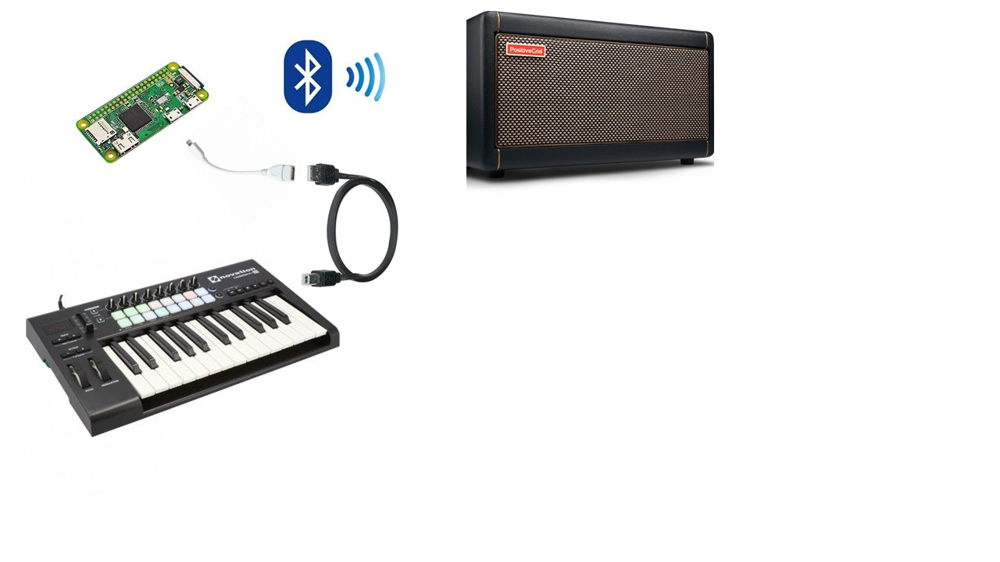
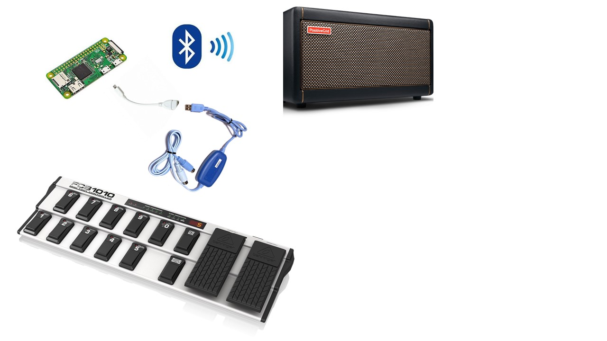

# MIDI-Spark-Control

## Control your Positive Grid Spark amp from a MIDI controller (via a Raspberry Pi)

This allows you to use a MIDI controller to send presets, change presets and change parameters (gain, volume, tone etc) on the Spark amp. It connects to the amp via bluetooth so can't be used at the same time as the App.

## Instructions

Get a Raspberry Pi with bluetooth (Pi 4 and Pi Zero W, I think the Pi 3 Model B too)

Prepare the Raspberry Pi - load the SD card with Pi Os, boot, set up a password, wifi etc

